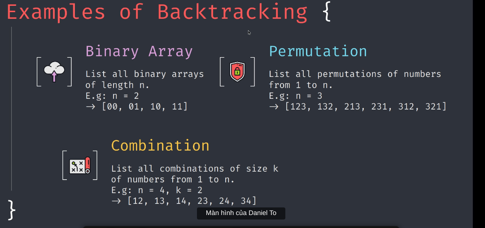

What?
Thuật toán đệ quy => khám phá ra tất cả TH

Why?
Khi mà không nghĩ được bài dp thì sẽ dùng cách backtracking, trừ những bài có backtracking là phương pháp tốt nhất

How?

Bài toán Binary Array: Liệt kê các dãy nhị phân độ dài n
Bài toán Permutation: Liệt kê các hoán vị từ 1 đến n
Bài toán Combination: Liệt kê tổ hợp chập k từ 1 đến n
