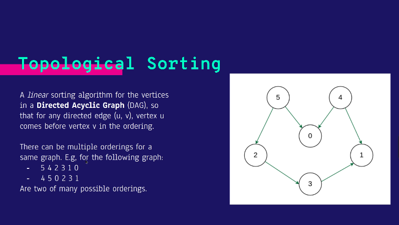

Với dạng DP Tree (3 dạng):

- Sub-tree: Đếm số nút của cây con
- Đường đi dài nhất
- Split-tree: Tách cây sao cho tích của tổng trọng số 2 cây là lớn nhất

Topo sort
Ý tưởng: Sắp xếp các đỉnh trong đồ thị theo một thứ tự mà đường tới luôn lớn hơn đường đi. Áp dụng cho đồ thị có hướng, không chu trình

